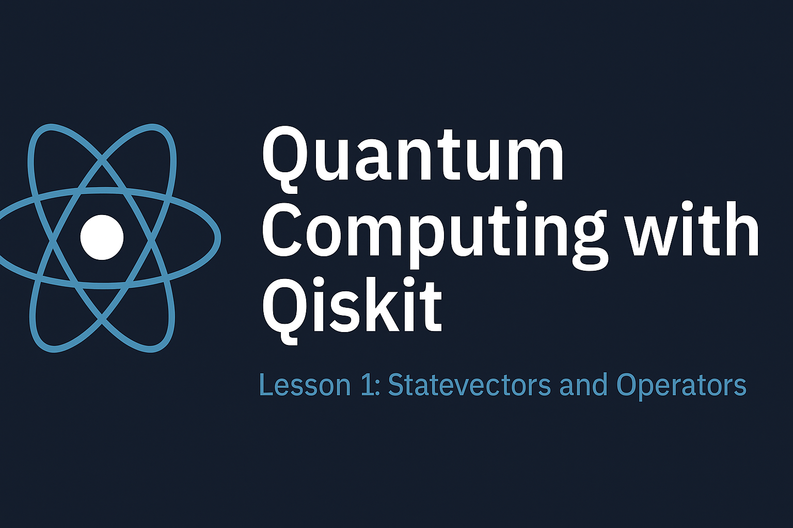

# Quantum Computing: First Steps with IBM Qiskit



---

## Welcome

This project is a beginner-level tutorial notebook for learning **Quantum Computing** using **IBM's Qiskit**. It walks through the fundamental concepts like quantum states, measurements, unitary operations, and quantum circuits — all in code using Python and Qiskit.

This notebook is part of my personal journey into the world of **Quantum Technologies** as a Master’s student in Embedded Systems Electronics.

---

## 📚 Course Reference

This content is based on **Lesson 1** from the [IBM Quantum Learning Course: Basics of Quantum Information](https://learning.quantum.ibm.com/course/basics-of-quantum-information), adapted and annotated with additional explanations, visualizations, and simulations to reinforce understanding.

All Qiskit-based examples, including `Statevector`, `Operator`, `QuantumCircuit`, and measurement simulations, are demonstrated clearly.

---

## 🧪 What You’ll Learn

- Understanding and visualizing quantum states.
- Performing quantum measurements and interpreting probabilities.
- Applying unitary transformations using `Operator`.
- Creating and evolving quantum circuits with `QuantumCircuit`.
- Simulating quantum experiments and visualizing results with `plot_histogram`.

---

## 🧑‍💻 About Me

I’m **Imene Belkorchia**, a Master’s student in **Embedded Systems Electronics** from Algeria 🇩🇿. I’m passionate about:

- Quantum computing 🧬
- Artificial intelligence 🤖
- Embedded systems and digital electronics ⚙️

This repository is part of my early steps in the field of **quantum programming**, and I’m committed to sharing my learning journey openly with the global tech community. 🌍

---

## 🔍 How to Use

1. Open the `quantum_intro_lesson1.ipynb` notebook in [Google Colab](https://colab.research.google.com/) or Jupyter.
2. Make sure Qiskit is installed using:

   ```bash
   !pip install qiskit
   
3. Run the code cells and experiment with the quantum operations.

---

## 📄 License

This project is published under the MIT License.
Feel free to use, modify, and share — but always credit the original authors (IBM Quantum) and contributors.

---

## Connect with Me

**GitHub: [cer-es](https://github.com/YourUsername)**

**LinkedIn: [Imene Belkorchia](www.linkedin.com/in/imene-belkorchia-543778349)**

**Kaggle: [Imene Belkorchia](https://www.kaggle.com/imenebelko)**

---

## 🚀 Technologies
- Python
- Qiskit
- Google Colab
